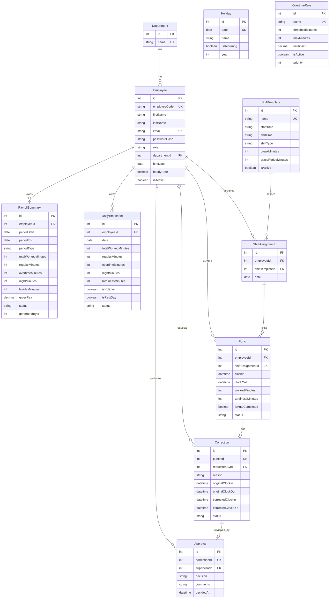

# ERD (Mermaid)

```mermaid
erDiagram
  Department ||--o{ Employee : has
  Employee ||--o{ ShiftAssignment : assigned
  ShiftTemplate ||--o{ ShiftAssignment : defines
  Employee ||--o{ Punch : creates
  ShiftAssignment ||--o{ Punch : links
  Punch ||--o| Correction : has
  Employee ||--o{ Correction : requests
  Correction ||--o| Approval : reviewed_by
  Employee ||--o{ Approval : performs
  Employee ||--o{ DailyTimesheet : owns
  Employee ||--o{ PayrollSummary : owns

  Department {
    int id PK
    string name UK
  }

  Employee {
    int id PK
    string employeeCode UK
    string firstName
    string lastName
    string email UK
    string passwordHash
    string role
    int departmentId FK
    date hireDate
    decimal hourlyRate
    boolean isActive
  }

  ShiftTemplate {
    int id PK
    string name UK
    string startTime
    string endTime
    string shiftType
    int breakMinutes
    int gracePeriodMinutes
    boolean isActive
  }

  ShiftAssignment {
    int id PK
    int employeeId FK
    int shiftTemplateId FK
    date date
  }

  Punch {
    int id PK
    int employeeId FK
    int shiftAssignmentId FK
    datetime clockIn
    datetime clockOut
    int workedMinutes
    int tardinessMinutes
    boolean isAutoCompleted
    string status
  }

  Correction {
    int id PK
    int punchId UK
    int requestedById FK
    string reason
    datetime originalClockIn
    datetime originalClockOut
    datetime correctedClockIn
    datetime correctedClockOut
    string status
  }

  Approval {
    int id PK
    int correctionId UK
    int supervisorId FK
    string decision
    string comments
    datetime decidedAt
  }

  Holiday {
    int id PK
    date date UK
    string name
    boolean isRecurring
    int year
  }

  OvertimeRule {
    int id PK
    string name UK
    int thresholdMinutes
    int maxMinutes
    decimal multiplier
    boolean isActive
    int priority
  }

  DailyTimesheet {
    int id PK
    int employeeId FK
    date date
    int totalWorkedMinutes
    int regularMinutes
    int overtimeMinutes
    int nightMinutes
    int tardinessMinutes
    boolean isHoliday
    boolean isRestDay
    string status
  }

  PayrollSummary {
    int id PK
    int employeeId FK
    date periodStart
    date periodEnd
    string periodType
    int totalWorkedMinutes
    int regularMinutes
    int overtimeMinutes
    int nightMinutes
    int holidayMinutes
    decimal grossPay
    string status
    int generatedById
  }
```
